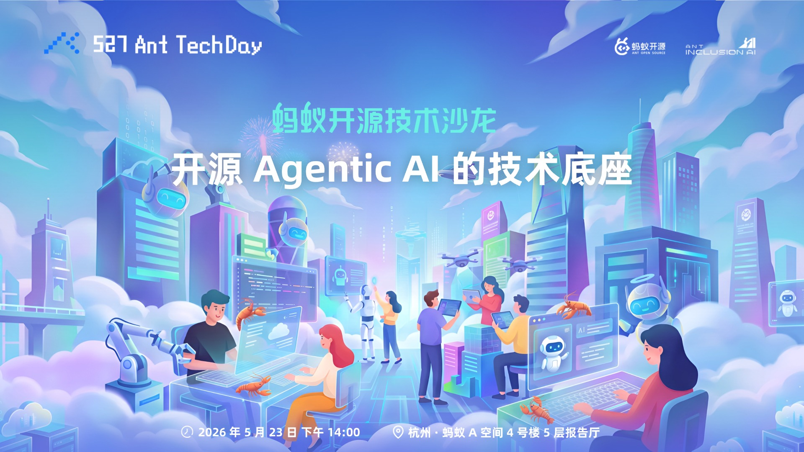

# 蚂蚁开源技术沙龙 × 开源 Agentic AI 的技术底座演讲材料归档

2026 年 5 月 23 日 杭州蚂蚁 A 空间，蚂蚁开源+inclusionAI 举办 “开源 Agentic AI 的技术底座：RL 赋能的大模型与真实世界落地” 主题技术沙龙，发布最新开源 Agentic AI Landscape ，并邀请了 AReaL、RLinf、Miles、百灵大模型、ASystem 等开源项目的一线技术专家，与广大开发者面对面深度交流。

此仓库收录了本次 Meetup 中所有分享的演讲材料，方便大家回顾和学习。欢迎加入我们的社区，一起交流与成长，更多丰富的开源活动欢迎关注蚂蚁开源！

相关链接：

- 蚂蚁开源官网: [https://opensource.antgroup.com/](https://opensource.antgroup.com/)
- 蚂蚁开源公众号二维码:  
  
